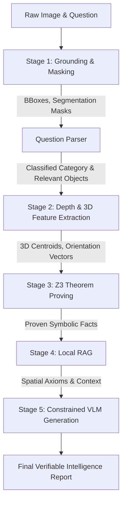
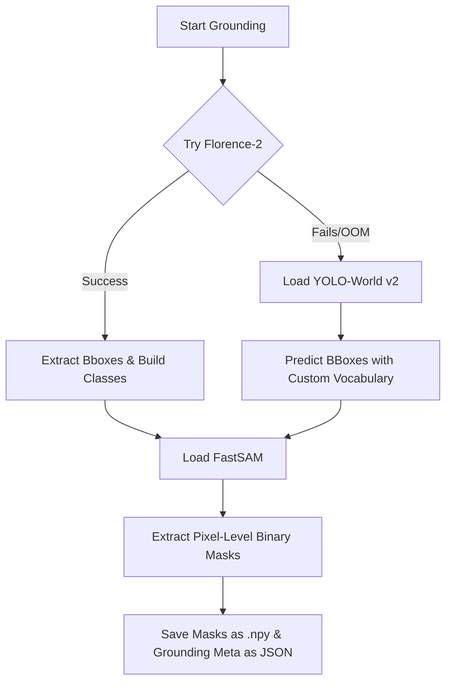

# Neuro-Symbolic Vision Pipeline: Concepts, Architecture, and Logic Deep Dive

This document provides an in-depth, rigorous explanation of the concepts, mathematical formulations, and software logic underlying the **Omni-Percept Universal Pipeline**. The project represents a state-of-the-art **Neuro-Symbolic AI** system designed for defense-grade, memory-safe, and mathematically verifiable visual reasoning.

---

## Table of Contents
1. [Theoretical Foundation: Neuro-Symbolic AI](#1-theoretical-foundation-neuro-symbolic-ai)
2. [System Architecture Overview](#2-system-architecture-overview)
3. [Deep-Dive Analysis of Components](#3-deep-dive-analysis-of-components)
    - [User Interface: app.py](#user-interface-apppy)
    - [Orchestration: pipeline_runner.py](#orchestration-pipeline_runnerpy)
    - [Question Parser: question_parser.py](#question-parser-question_parserpy)
    - [Stage 1: Grounding & Masking (stage1_grounding.py)](#stage-1-grounding--masking-stage1_groundingpy)
    - [Stage 2: Metric Depth & 3D Feature Extraction (stage2_geometry.py)](#stage-2-metric-depth--3d-feature-extraction-stage2_geometrypy)
    - [Stage 3: Universal Z3 Theorem Proving (stage3_z3.py)](#stage-3-universal-z3-theorem-proving-stage3_z3py)
    - [Stage 4: Local RAG (stage4_rag.py)](#stage-4-local-rag-stage4_ragpy)
    - [Stage 5: Constrained Generation (stage5_vlm.py)](#stage-5-constrained-generation-stage5_vlmpy)
    - [Memory Utilities: memory_utils.py](#memory-utilities-memory_utilspy)
4. [Mathematical & Logical Formulation Summary](#4-mathematical--logical-formulation-summary)
5. [System Requirements & Local Execution Flow](#5-system-requirements--local-execution-flow)

---

## 1. Theoretical Foundation: Neuro-Symbolic AI

Traditional visual reasoning systems rely heavily on deep neural networks (e.g., Vision-Language Models or VLMs) to answer spatial queries. However, deep networks suffer from fundamental limitations:
- **Hallucination:** Generating plausible-sounding but factually incorrect details.
- **Geometrical Inaccuracy:** Inability to perform exact geometric and spatial measurements (e.g., calculating precise 3D distances or line-of-sight occlusions).
- **Black-Box Nature:** Lack of verifiable proof or formal guarantees for the generated answers.

**Neuro-Symbolic AI** solves this by splitting the cognitive workload into two distinct paradigms:
1. **The Neural Component (Perception):** Deep networks are used for what they do best—perceiving unstructured data (images) to identify object boundaries (grounding), segmentation masks, and relative depth maps.
2. **The Symbolic Component (Reasoning):** Deterministic mathematical equations and a formal Satisfiability Modulo Theories (SMT) solver (Z3) are used to deduce logical relations (such as relative orientation, metric distance, and spatial occlusion) from the perceptual features. 

By combining these paradigms, the VLM in the final stage is strictly constrained to answer questions based *only* on mathematically proven facts, guaranteeing verification and eliminating hallucination.

---

## 2. System Architecture Overview

The pipeline executes sequentially, with data flowing from raw visual inputs to formal mathematical proofs, and finally to a structured language response:



---

## 3. Deep-Dive Analysis of Components

### User Interface: [app.py](file:///Users/amrit/Documents/Amrit/Research_Work/Chaitra%20Ma'am%20DBMS/repo/visionresearch/omni_percept_universal/app.py)

#### Purpose & Design
The user interface is built using Gradio (`gr.Blocks`), styled with a modern soft theme. It accepts two primary inputs:
- **Image Input:** An image file upload (`gr.Image` filepath mode).
- **Critical Question:** A text input defining the spatial query (e.g., *"Is the truck facing the tree?"*).

#### Logic Flow & Gradio Integration
1. The UI is split into a layout with two columns: inputs on the left, outputs on the right.
2. The outputs are grouped within tabs to showcase intermediate pipeline results:
   - **X-Ray Vision:** Shows the processed segmentation masks and bounding boxes.
   - **Z3 Prover Terminal:** Shows raw mathematical proofs.
   - **RAG Context:** Displays relevant logical principles retrieved from ChromaDB.
   - **Final Intelligence Report:** Renders the verified markdown output.
3. The pipeline runs asynchronously using Gradio's sequential updates. `run_btn.click` invokes `execute_pipeline`, passing inputs and writing yield updates back to the UI components.

---

### Orchestration: [pipeline_runner.py](file:///Users/amrit/Documents/Amrit/Research_Work/Chaitra%20Ma'am%20DBMS/repo/visionresearch/omni_percept_universal/pipeline_runner.py)

#### Purpose & Design
Acts as the central controller, executing the pipeline step-by-step, managing file-system caching in `data/temp`, and applying aggressive memory cleanup after each step.

#### Logic Flow
1. **Input Verification:** Rejects execution and alerts the user if either the image path or critical question is missing.
2. **Stage 1 (Grounding):** Calls `run_grounding_and_masking` to detect boxes, masks, and save them.
3. **Semantic Filtering:** Invokes `parse_question_type` to parse the question category (e.g., orientation, distance) and extract the target objects of interest.
4. **Stage 2 (Geometry):** Computes metric depth and 3D geometric centroids/vectors.
5. **Stage 3 (Z3 Solver):** Translates physical attributes into SMT constraints and proves spatial facts.
6. **Stage 4 (Local RAG):** Queries ChromaDB with the proven facts to retrieve corresponding architectural definitions.
7. **Stage 5 (VLM Generation):** Passes the image, question, facts, and retrieved spatial axioms to the VLM (Ollama) to synthesize the final verified report.
8. **Memory Management:** Invokes `clear_memory()` after every step to ensure high throughput and prevent CUDA/MPS out-of-memory errors.

---

### Question Parser: [question_parser.py](file:///Users/amrit/Documents/Amrit/Research_Work/Chaitra%20Ma'am%20DBMS/repo/visionresearch/omni_percept_universal/src/question_parser.py)

#### Purpose & Design
A heuristic-based natural language processor that categorizes the user's intent and filters out irrelevant background objects to reduce the computational search space.

#### Categorization Logic
The parser evaluates the lowercase question string against keyword arrays:
- **`ABSOLUTE_ORIENTATION`:** Matches keywords like `"facing left"`, `"facing right"`, `"point left"`, `"point right"`, or `"pointing"`.
- **`RELATIVE_ORIENTATION`:** Matches `"facing"`, `"look at"`, or `"looking at"`.
- **`OCCLUSION`:** Matches `"behind"`, `"occluded"`, `"cover"`, or `"hide"`.
- **`DISTANCE`:** Matches `"how far"`, `"distance"`, `"close"`, `"near"`, or `"next to"`.
- **`GENERAL`:** Default fallback category.

#### Target Extraction
It iterates through the set of detected labels and builds a list of `relevant_objects` containing only those whose label is a substring of the question.

---

### Stage 1: Grounding & Masking ([stage1_grounding.py](file:///Users/amrit/Documents/Amrit/Research_Work/Chaitra%20Ma'am%20DBMS/repo/visionresearch/omni_percept_universal/src/stage1_grounding.py))

#### Purpose & Design
Provides open-vocabulary object detection (grounding) and instance segmentation. It identifies objects, maps class labels, and computes detailed binary segmentation masks.

#### Architectural Fallback Pattern
The model implements a robust fallback structure:


1. **Florence-2 (`microsoft/Florence-2-large`):** Under task prompt `<OD>` (Generic Object Detection), Florence-2 acts as the primary detector. It parses arbitrary objects dynamically and returns class labels and `xyxy` bounding boxes.
2. **YOLO-World (`yolov8s-worldv2.pt`):** If Florence-2 crashes or fails, YOLO-World is loaded. The vocabulary classes list is set dynamically on the model using `model.set_classes()`.
3. **Instance Segmentation via FastSAM (`FastSAM-s.pt`):** The bounding boxes obtained from the detector are passed as bounding box prompts to FastSAM to extract high-fidelity binary segmentation masks.

#### Mask Processing & Realignment
FastSAM's output masks are post-processed:
- Masks are resized to the original image dimensions using Nearest-Neighbor interpolation:
  $$M_{\text{resized}} = \text{resize}(M, (W_{\text{orig}}, H_{\text{orig}}), \text{method}=\text{INTER\_NEAREST})$$
  This maintains the binary nature of the mask without smoothing threshold boundaries.
- To prevent indexing mismatch, if FastSAM returns fewer masks than detected bounding boxes, the list is padded with empty boolean arrays:
  $$M_i \in \{0\}^{H \times W}$$
- Each mask is saved to disk as a separate NumPy array binary file (`mask_{i}.npy`) to avoid embedding massive boolean matrices inside the metadata JSON.
- An annotated image containing segmentation overlays, bounding box lines, and confidence labels is drawn using `supervision` and saved to `data/temp/annotated_image.jpg`.

---

### Stage 2: Metric Depth & 3D Feature Extraction ([stage2_geometry.py](file:///Users/amrit/Documents/Amrit/Research_Work/Chaitra%20Ma'am%20DBMS/repo/visionresearch/omni_percept_universal/src/stage2_geometry.py))

#### Purpose & Design
Extracts 3D spatial coordinate data and principal directions for each object by integrating monocular depth estimation with image processing techniques.

#### Depth Estimation & Normalization
1. **Model:** Uses `depth-anything/Depth-Anything-V2-Small-hf` (with fallback to `Intel/dpt-large`) to perform relative depth estimation, yielding a disparity map $D(x, y)$ where larger values represent elements closer to the camera lens.
2. **Distance Proxy Formulation:** The disparity map is inverted to represent distance:
   $$\text{DistMap}(x, y) = \frac{1.0}{D(x, y) + \epsilon}$$
   where $\epsilon = 10^{-6}$ to prevent division-by-zero.
3. **Min-Max Scaling:** The distance map is normalized to a $[0.0, 100.0]$ range for numerical stability in the Z3 solver:
   $$\text{DistMap}_{\text{norm}}(x, y) = \frac{\text{DistMap}(x, y) - \min(\text{DistMap})}{\max(\text{DistMap}) - \min(\text{DistMap}) + \epsilon} \times 100.0$$

#### Feature Extraction Algorithm

##### 1. Z-axis Depth Coordinate
For each object $i$, the median distance within its binary mask $M_i$ is computed:
$$z_i = \text{median}(\{\text{DistMap}_{\text{norm}}(x, y) \mid M_i(x, y) = 1\})$$
*Why Median?* The median acts as a robust statistic that rejects depth noise at the edges of the mask boundary where the background might blend in.

##### 2. X, Y 2D Centroid Calculation
Calculated using **Image Moments** on the object's binary mask:
$$M_{pq} = \sum_{x} \sum_{y} x^p y^q I(x, y)$$
where $I(x, y) \in \{0, 255\}$ is the uint8 representation of the binary mask. The centroid $(c_x, c_y)$ is derived as:
$$c_x = \frac{M_{10}}{M_{00}}, \quad c_y = \frac{M_{01}}{M_{00}}$$
*Fallback:* If the mask area $M_{00} = 0$, the centroid falls back to the center of the 2D bounding box:
$$c_x = \frac{x_1 + x_2}{2}, \quad c_y = \frac{y_1 + y_2}{2}$$
Combining these coordinates yields the 3D Centroid:
$$\mathbf{C}_i = (c_x, c_y, z_i)$$

##### 3. 2D Principal Orientation Angle & Vector
1. Contours are extracted from the binary mask using OpenCV's boundary tracking (`cv2.findContours`).
2. The largest contour is selected, and a minimum bounding rectangle is fitted around it using:
   $$\text{rect} = \text{cv2.minAreaRect}(\text{contour})$$
   which yields a center, dimensions, and rotation angle $\theta \in [-90^\circ, 0^\circ)$.
3. This angle $\theta$ is converted to a unit vector representing the object's major axis orientation:
   $$\mathbf{O}_i = (\cos(\theta), \sin(\theta))$$

---

### Stage 3: Universal Z3 Theorem Proving ([stage3_z3.py](file:///Users/amrit/Documents/Amrit/Research_Work/Chaitra%20Ma'am%20DBMS/repo/visionresearch/omni_percept_universal/src/stage3_z3.py))

#### Purpose & Design
Translates the visual perception and geometry features into formal mathematical constraints and uses the SMT solver **Z3** to prove spatial truths. This guarantees that relations like distance, alignment, and occlusion are mathematically sound and verifiable.

#### Logical Branches & Formulations

##### Branch 1: Absolute Orientation
Used when the question category is `ABSOLUTE_ORIENTATION` (e.g., "pointing left").
- Declares two Z3 Bool constants: $\text{FacingLeft}$ and $\text{FacingRight}$.
- Evaluates the x-component of the major axis unit vector $O_x$:
  - If $O_x < 0$, it adds:
    $$\text{FacingLeft} \equiv \text{True}, \quad \text{FacingRight} \equiv \text{False}$$
  - If $O_x \ge 0$, it adds:
    $$\text{FacingRight} \equiv \text{True}, \quad \text{FacingLeft} \equiv \text{False}$$
- Resolves the solver: if SAT, the solver verifies which assertion holds true.

##### Branch 2: Symmetrical and Pairwise Relationships
For all distinct pairs of detected objects $i$ and $j$ ($i \ne j$):

###### Logic A: 3D Euclidean Distance
- Declares a Z3 Real constant representing the distance variable: $d_{ij} = \text{Z3.Real}(\text{"Dist\_}i\text{\_}j\text{"})$.
- Computes the geometric Euclidean distance between their 3D centroids $\mathbf{C}_i = (x_i, y_i, z_i)$ and $\mathbf{C}_j = (x_j, y_j, z_j)$:
  $$d_{\text{actual}} = \sqrt{(x_j - x_i)^2 + (y_j - y_i)^2 + (z_j - z_i)^2}$$
- Adds the constraint to the solver:
  $$d_{ij} == d_{\text{actual}}$$

###### Logic B: Spatial Occlusion
- Declares a Z3 Bool constant: $\text{Occludes}_{ij} = \text{Z3.Bool}(i\text{ occludes }j)$.
- Computes the 2D intersection of their binary masks:
  $$\text{Overlap} = M_i \cap M_j$$
- Evaluates if there is an intersection ($\exists (x,y) \text{ s.t. } \text{Overlap}(x,y) = 1$) and compares their relative distance along the camera optical axis (Z-depth):
  $$\text{IsOccluding} = \begin{cases} \text{True} & \text{if } \text{Overlap} \ne \emptyset \text{ and } z_i < z_j \\ \text{False} & \text{otherwise} \end{cases}$$
- Adds the constraint to the solver:
  $$\text{Occludes}_{ij} == \text{IsOccluding}$$

###### Logic C: Relative Orientation (Facing/Alignment)
- Declares a Z3 Bool constant: $\text{Facing}_{ij} = \text{Z3.Bool}(i\text{ facing }j)$.
- Computes the 2D directional vector pointing from object $i$ to object $j$ in the image plane:
  $$\mathbf{V}_{ij} = (c_{x,j} - c_{x,i}, \,\, c_{y,j} - c_{y,i})$$
- Normalizes this direction vector to a unit vector:
  $$\hat{\mathbf{V}}_{ij} = \frac{\mathbf{V}_{ij}}{\|\mathbf{V}_{ij}\|}$$
- Performs the dot product between the source object's principal orientation vector $\mathbf{O}_i$ and the relative direction unit vector $\hat{\mathbf{V}}_{ij}$:
  $$\text{dot} = \mathbf{O}_i \cdot \hat{\mathbf{V}}_{ij}$$
- Checks if their axes align within a $45^\circ$ cone (where $|\text{dot}| \ge \cos(45^\circ) \approx 0.707$):
  $$\text{IsFacing} = \begin{cases} \text{True} & \text{if } |\text{dot}| \ge 0.707 \\ \text{False} & \text{otherwise} \end{cases}$$
- Adds the constraint to the solver:
  $$\text{Facing}_{ij} == \text{IsFacing}$$

##### Solver Validation
At the end of each object-pair loop:
1. Calls `solver.check()`. If it returns `z3.sat`, the solver evaluates the variables.
2. Extracts model evaluations (converts rational fractions like `RatNumRef` to standard python floats where necessary).
3. Outputs text facts to construct a list of proved statements:
   - *Distance facts* are constrained to $i < j$ to avoid symmetric duplicates (e.g., "Distance from A to B is 10" and "Distance from B to A is 10").
   - *Occlusion and Facing facts* are kept directional (since $A$ occluding $B$ does not mean $B$ occludes $A$).
4. The solver is reset (`solver.reset()`) for the next iteration to keep execution clean.

---

### Stage 4: Local RAG ([stage4_rag.py](file:///Users/amrit/Documents/Amrit/Research_Work/Chaitra%20Ma'am%20DBMS/repo/visionresearch/omni_percept_universal/src/stage4_rag.py))

#### Purpose & Design
Retrieval-Augmented Generation (RAG) is used to contextualize the mathematical proofs by pulling human-readable logical rules from a vector database. This helps ground the VLM's explanation in formal spatial geometry principles.

#### Mechanics & ChromaDB Integration
1. **Initialization:** Instantiates a persistent ChromaDB client pointing to `data/db/` and accesses or creates a collection named `"universal_logic"`.
2. **Knowledge Seeding:** If the database contains no documents, it seeds three core spatial axioms:
   - **Rule 1 (Facing):** *"When Object A's major axis vector aligns with the vector to Object B, A is considered 'facing' B."*
   - **Rule 2 (Occlusion):** *"If Object A and B intersect in 2D space, but A's depth value is lower than B's, A is physically occluding B."*
   - **Rule 3 (Proximity):** *"The relative Euclidean distance between 3D centroids determines spatial proximity in the metric space."*
3. **Querying:** If Z3 facts are successfully generated, the entire text block of facts is embedded and queried against the collection. It retrieves the top $N=2$ matching rules.
4. **Context Injection:** The retrieved rules are formatted as a bulleted text context to be fed directly into the downstream VLM prompt.

---

### Stage 5: Constrained Generation ([stage5_vlm.py](file:///Users/amrit/Documents/Amrit/Research_Work/Chaitra%20Ma'am%20DBMS/repo/visionresearch/omni_percept_universal/src/stage5_vlm.py))

#### Purpose & Design
Uses a Vision-Language Model to synthesize a final intelligence report in natural language. The report answers the user's question by combining the visual data with the hard mathematical facts and RAG context.

#### Ollama Integration & Prompt Engineering
- **Model:** Connects to a local Ollama server running at `http://localhost:11434` requesting the `qwen2.5vl:3b` model.
- **Multimodal Payload:** The original image is read, converted to a base64 encoded string, and injected into the payload under the `"images"` field:
  $$\text{Base64Img} = \text{base64Encode}(\text{FileRead}(image\_path))$$
- **Prompt Strategies:**
  - **Scenario A (Verified Case):** If Z3 facts and RAG context are available, the system constructs a highly constrained system prompt:
    ```text
    You are a precision visual analyst. 
    Here are mathematically proven facts: 
    {z3_facts}

    Here is spatial context: 
    {rag_context}

    Answer the user's critical question using ONLY these facts. Do not hallucinate any other information.

    Critical Question: {critical_question}
    ```
    This forces the model to act as a parser of the mathematical facts rather than guessing from the raw pixels.
  - **Scenario B (Unverified Fallback):** If no spatial constraints are found, it alerts the model with a warning:
    ```text
    WARNING: Mathematical verification unavailable. Detected objects: {detected_list}. Question: {critical_question}. Provide best-effort visual analysis and explicitly mark this answer as UNVERIFIED.
    ```
    This explicitly flags the output to the user as a non-guaranteed visual estimate.

---

### Memory Utilities: [memory_utils.py](file:///Users/amrit/Documents/Amrit/Research_Work/Chaitra%20Ma'am%20DBMS/repo/visionresearch/omni_percept_universal/src/memory_utils.py)

#### Purpose & Design
Provides deterministic memory reclamation functions to keep the system running efficiently on target hardware (e.g., Apple Silicon Macs).

#### Logic
- Checks if Apple Silicon hardware acceleration is active (`torch.backends.mps.is_available()`). If so, calls `torch.mps.empty_cache()` to clear allocated VRAM.
- Invokes Python's garbage collector (`gc.collect()`) to remove dereferenced model weights from CPU system memory.

---

## 4. Mathematical & Logical Formulation Summary

Below is a consolidated reference of the mathematical and logical rules implemented in the code:

| Concept | Equation / Logical Definition | Code Implementation Location |
| :--- | :--- | :--- |
| **Distance Proxy** | $\text{DistMap}(x, y) = \frac{1.0}{D(x, y) + \epsilon}$ | [stage2_geometry.py:34](file:///Users/amrit/Documents/Amrit/Research_Work/Chaitra%20Ma'am%20DBMS/repo/visionresearch/omni_percept_universal/src/stage2_geometry.py#L34) |
| **Normalisation** | $\text{DistMap}_{\text{norm}} = \frac{\text{Dist} - \min}{\max - \min + \epsilon} \times 100.0$ | [stage2_geometry.py:36](file:///Users/amrit/Documents/Amrit/Research_Work/Chaitra%20Ma'am%20DBMS/repo/visionresearch/omni_percept_universal/src/stage2_geometry.py#L36) |
| **Z-Depth (Object)** | $z_i = \text{median}(\{\text{DistMap}_{\text{norm}}(x, y) \mid M_i(x,y)=1\})$ | [stage2_geometry.py:53-54](file:///Users/amrit/Documents/Amrit/Research_Work/Chaitra%20Ma'am%20DBMS/repo/visionresearch/omni_percept_universal/src/stage2_geometry.py#L53-L54) |
| **X, Y Centroid** | $c_x = \frac{M_{10}}{M_{00}}, \quad c_y = \frac{M_{01}}{M_{00}}$ | [stage2_geometry.py:58-62](file:///Users/amrit/Documents/Amrit/Research_Work/Chaitra%20Ma'am%20DBMS/repo/visionresearch/omni_percept_universal/src/stage2_geometry.py#L58-L62) |
| **2D Orientation Vector** | $\mathbf{O}_i = (\cos(\theta), \sin(\theta))$ | [stage2_geometry.py:85-86](file:///Users/amrit/Documents/Amrit/Research_Work/Chaitra%20Ma'am%20DBMS/repo/visionresearch/omni_percept_universal/src/stage2_geometry.py#L85-L86) |
| **Z3 3D Distance** | $d_{ij} == \sqrt{(x_j - x_i)^2 + (y_j - y_i)^2 + (z_j - z_i)^2}$ | [stage3_z3.py:67-70](file:///Users/amrit/Documents/Amrit/Research_Work/Chaitra%20Ma'am%20DBMS/repo/visionresearch/omni_percept_universal/src/stage3_z3.py#L67-L70) |
| **Z3 Occlusion** | $\text{Overlap} \ne \emptyset \,\,\land\,\, z_i < z_j$ | [stage3_z3.py:73-90](file:///Users/amrit/Documents/Amrit/Research_Work/Chaitra%20Ma'am%20DBMS/repo/visionresearch/omni_percept_universal/src/stage3_z3.py#L73-L90) |
| **Z3 Alignment / Facing** | $\text{Facing}_{ij} \equiv \left( \left| \mathbf{O}_i \cdot \frac{\mathbf{C}_j - \mathbf{C}_i}{\|\mathbf{C}_j - \mathbf{C}_i\|} \right| \ge 0.707 \right)$ | [stage3_z3.py:93-111](file:///Users/amrit/Documents/Amrit/Research_Work/Chaitra%20Ma'am%20DBMS/repo/visionresearch/omni_percept_universal/src/stage3_z3.py#L93-L111) |

---

## 5. System Requirements & Local Execution Flow

### Execution Requirements
To run the pipeline locally, you must ensure the following models and configurations are available:

1. **Python Dependencies:** Installed via `pip install -r requirements.txt`.
2. **Model Weights (Ultralytics and Hugging Face Hub):**
   - YOLO-World weights: `yolov8s-worldv2.pt` (automatically downloaded to workspace on first use).
   - FastSAM weights: `FastSAM-s.pt` (placed in the working directory).
   - HuggingFace Models: `microsoft/Florence-2-large` and `depth-anything/Depth-Anything-V2-Small-hf` are downloaded automatically to the Hugging Face cache directory.
3. **Local Ollama Inference Engine:**
   - Running in the background (`ollama serve`).
   - The model `qwen2.5vl:3b` must be pulled locally (`ollama pull qwen2.5vl:3b`).

### Diagnostic Troubleshooting
- **Ollama connection failure:** If Stage 5 fails, ensure that Ollama is listening on port `11434`. You can test this via:
  ```bash
  curl http://localhost:11434/api/tags
  ```
- **MPS Acceleration on Mac:** The pipeline automatically leverages Apple Silicon's Unified Memory architecture via PyTorch's MPS backend, significantly reducing processing times for depth estimation and object grounding.
